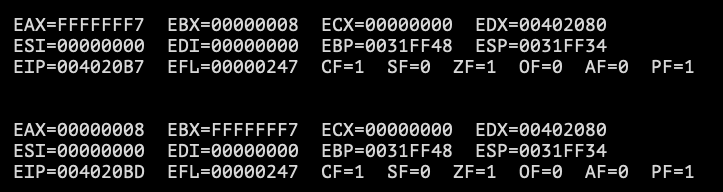

# Notes
# Table of Contents

* Instructions
* [XCHG](#xchg)
  

# XCHG <a name="xchg"></a>

```XCHG``` will exchange the contents of the two operands.

```assembly
XCHG reg, reg
XCHG reg, mem
XCHG mem, reg
```



# Syntax

* [Wine](#xchg)
# Install Wine <a name="wine"></a>