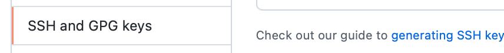

# Table of Contents

* Installation
  * [WINE](#wine)
  * [Add SSH to account](#SSH)

* Instructions

  * [MOV](#mov)

  

* [How to get listing file (Visual Studio)](#How_to_get_listing_file)
  
  * [Sample Listing File](#sample_Listing_File)


# Install Wine <a name="wine"></a>

```bash
dpkg --print-architecture

dpkg --print-foreign-architectures
sudo dpkg --add-architecture i386
dpkg --print-foreign-architectures

wget -nc https://dl.winehq.org/wine-builds/winehq.key

sudo -H gpg -o /etc/apt/trusted.gpg.d/winehq.key.gpg --dearmor winehq.key

# Add the repository.

sudo add-apt-repository 'deb https://dl.winehq.org/wine-builds/ubuntu/ focal main'

sudo apt update

sudo apt install --install-recommends winehq-stable

wine --version
```


# Add SSH Key to Github <a name="SSH"></a>

**Run on your linux machine**

```bash
ssh-keygen -t ed25519 -C "username@company.com"
# save the file
# hit enter twice if you don't want to have passphrase
```

**Copy the key** 

```bash
cat ~/.ssh/id_ed25519.pub
# Copy this key. We will need in the next step.
# key will be in this format
# ssh-ed25519 aljhjalASAKND/ASDSDSDd/sdfdfdJDD/Ksdsds username@company.com
```

**Add to Github** 

Go to your account settings. List of options, looks for SSH and GPG keys




1. Click on SSH and GPG keys
2. New Key
3. Give a tittle to your key {Spare laptop}
   1. Control V
      1. run this on your linux  machine ```cat ~/.ssh/id_ed25519.pub``` again
      2. copy and paste this key into Github account.
4. Save the key


# MOV <a name="mov"></a>

:heavy_check_mark: This instruction copies the source operand to destination operand, leaving source operand unchanged.

```mov destination, source```

:heavy_check_mark: Both Operands must be of same size.

:x: Both operands cannot be memory operand.

:x: CS, EIP, and IP cannot be destination operands.

:x: an immediate value cannot be moved to a segment register.


To move data from memory to another memory location, move source memory operand's value to register and then copy value from register to destination operand.


## [How to get listing file (Visual Studio)](<a name="How_to_get_listing_file"></a>)


## [Sample Listing File]<a name="sample_Listing_File"></a>

Here is the sample Listing file: [Sample Listing file](/docs/default/irvine.lst)


​	
