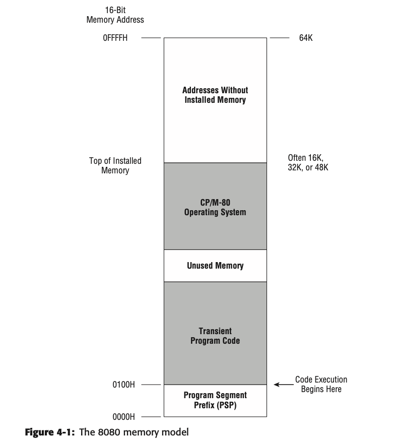

# Memory

There are different ways to address memory in x86, called ***memory model***. 

Priotected mode flat model is available only on the 386 and newer CPUs that support the IA-32 architecture. The 8086, 8088, and 80286 do not support it.

The 8080 was an 8-bit CPU, meaning it processed 8 bits of information at a time. However, it had 16 addres lines coming out of it. Sixteen address lines will address 64K bytes. This means that every one of 65,536 separate memory locations can have its own unique address, from 0 up to 65,535.

The first 256 bytes of memory were called the ***program segment prefix (PSP)*** and contained various odd bits of information as well as a general-purpose memory buffer for the program’s disk input/output (I/O). The executable code itself did not begin until address 0100H.

This was done by the use of *segment registers,* which are basically memory pointers located in CPU registers that point to a place in memory where things begin, be this data storage, code execution, or anything else.